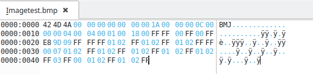
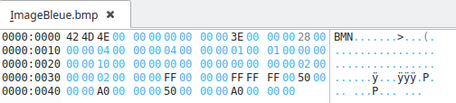

SAE image

Partie A

A.0)
Il faut augmenter la taille du fichier dans oketa de 1.

A.1)

A.2)

A.3)
Le poid de l'image passe de 72 a 102.

1) 24 bits par pixel car c'est toujours marqué 18 à l'endroit qui dit il y a combie de bit par pixel.
2)elle vas de 30 jusqu'a 66 donc 48 octet. On peut aussi le deviner car c'est une image de 16 pixels et que chaque pixels est coder sur 3 octet donc 16*3 = 48.
3)Non 
4)Les pixels sont toujours codé sur 3 octets

A.4)

1) Il y a 1 bit par pixels
2) 16 pixels car l'image a 16 pixels et que chaque pixel est codé sur 1 bit.
3)Oui, il y a une compression.
4)Les couleurs sont codé sur 4 octets et se situe juste après l'entète du fichier.
5)Il y a 2 couleurs dans la palette. Ici dans notre exemple c'est le rouge (00 FF FF 00) et le blanc (FF FF FF 00)
6)Oui il a changé. Maintenant il faut codé un quartet et chaque bit de ce quartet représente un pixel. 1 quartet représente une ligne de notre dammier. Cela donne donc:

R = Rouge
B = Blanc
1010 -> A = BRBR
0101 -> 5 = RBRB
1010 -> A = BRBR
0101 -> 5 = RBRB

Cela nous donne notre dammier rouge et blanc.

7)

8)

11)
On peut le trouver à l'adresse 2E.

12)
On peut trouver le blanc à l'adresse 66

13)
Le tableau de pixels commence en 76